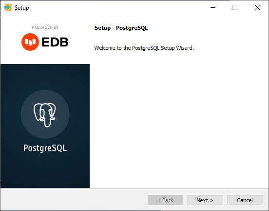
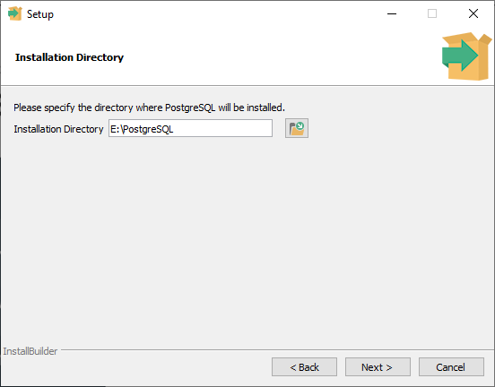
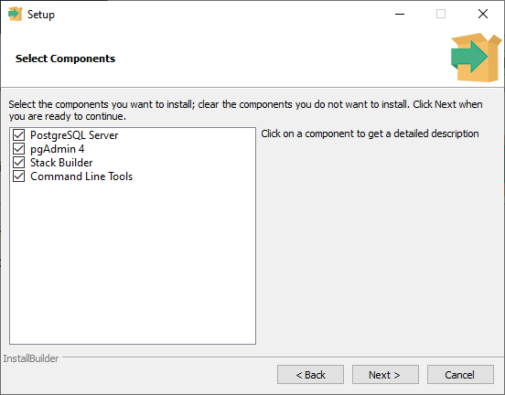
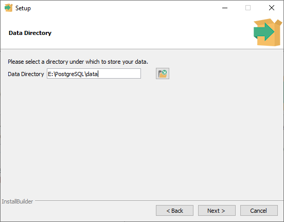
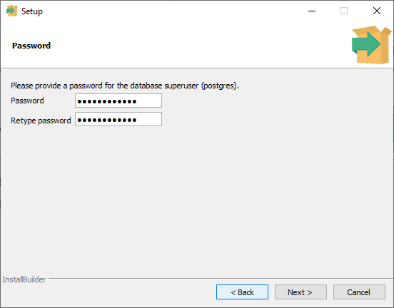
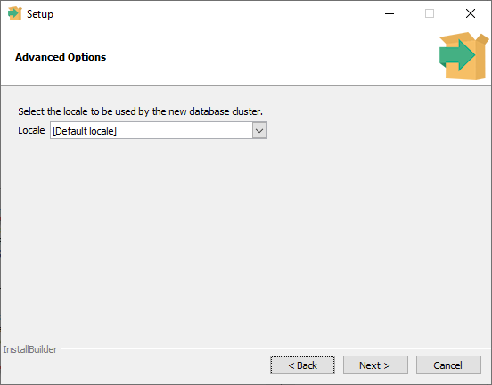
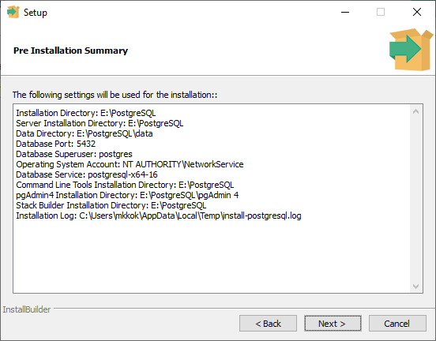
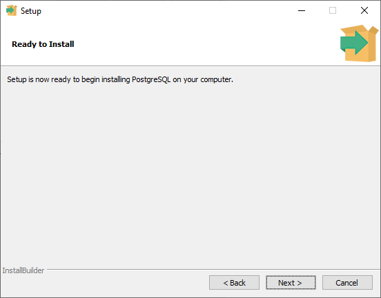
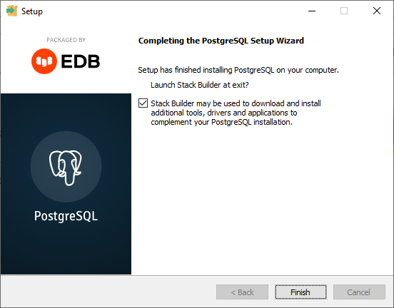

## Instalacja serwera PostgreSQL
Uruchamiamy instalator  
  
Wybieramy lokalizacje instalacji PostgreSQL   
  
Wybieramy komponenty które chcemy zainstalować  
  
Wybieramy lokalizację w której będą zapisywane dane  
  
Podajemy hasło administratora baz danych(super user)  
  
Wybieramy "regionalność" naszego PostgreSQL  
  
Sprawdzmy podsumowanie instalacji i jeśli wszystko się zgadza przewchodzimy dalej  
  
Uruchamiamy instalacje  
  
Odznaczamy opcje Stack builder i zakańczamy instalacje  
  
