# SMTP

## Czym jest SMTP
SMTP (ang. Simple Mail Transfer Protocol) – protokół komunikacyjny opisujący sposób przekazywania poczty elektronicznej w Internecie.SMTP to względnie prosty, tekstowy protokół, w którym określa się co najmniej jednego odbiorcę wiadomości (w większości przypadków weryfikowane jest jego istnienie), a następnie przekazuje treść wiadomości. SMTP działa najczęściej na porcie 25. Można przetestować serwer SMTP przy użyciu programu telnet.

## Ograniczenia
Jednym z ograniczeń pierwotnego SMTP jest brak mechanizmu weryfikacji nadawcy, co ułatwia rozpowszechnianie niepożądanych treści poprzez pocztę elektroniczną (wirusy komputerowe, spam). Żeby temu zaradzić stworzono rozszerzenie SMTP-AUTH, które jednak jest tylko częściowym rozwiązaniem problemu - ogranicza wykorzystanie serwera wymagającego autoryzacji do zwielokrotniania poczty. Nadal nie istnieje metoda, dzięki której odbiorca uwierzytelniłby nadawcę – nadawca może "udawać" serwer i wysłać dowolny komunikat do dowolnego odbiorcy.  

Protokół ten nie radził sobie dobrze z plikami binarnymi, ponieważ stworzony był w oparciu o czysty tekst ASCII. W celu kodowania plików binarnych do przesyłu przez SMTP stworzono standardy takie jak MIME. W dzisiejszych czasach większość serwerów SMTP obsługuje rozszerzenie 8BITMIME pozwalające przesyłać pliki binarne równie łatwo jak tekst.

SMTP nie pozwala na pobieranie wiadomości ze zdalnego serwera

## Instalacja na Windows server
Wybieramy opcje **Dodaj role i funkcjie**  
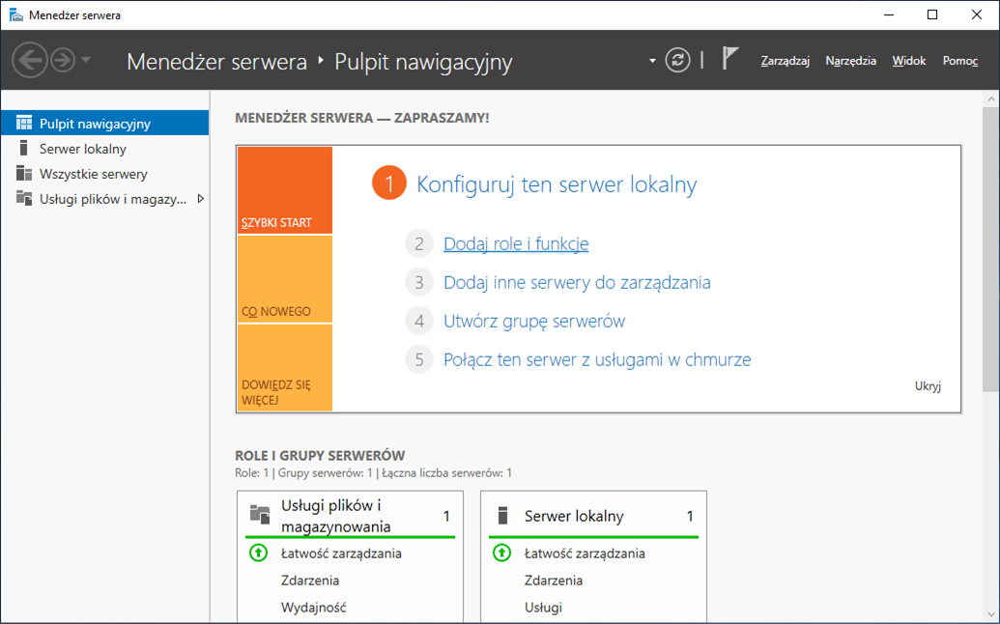
Wybieramy instalacje opartą na rolach
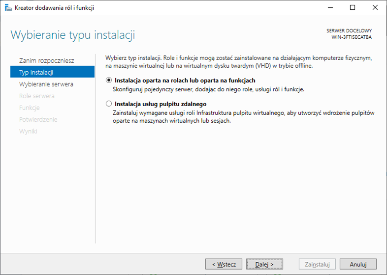
Nie wybieramy żadnej roli serwera i przechodzimy dalej
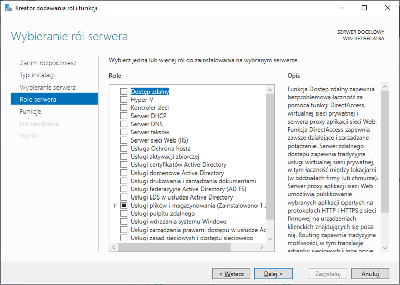
Zaznaczamy funkcje **Serwer SMTP** i naciskamy dalej
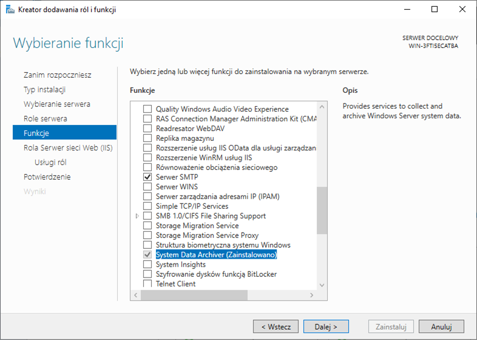
Dodajemy dodatkowe funkcje wymagane przez serwert SMTP  
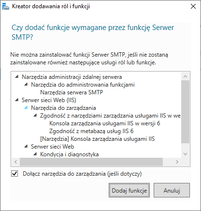  
Instalujemy serwer sieci Web
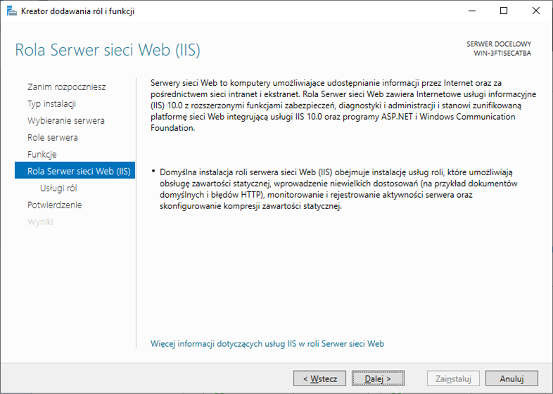
Wybieramy dodatkowe potrzebne nam usługi serwera sieci Web, wszystkie usługi wymagane przes SMTP są juz zaznaczone
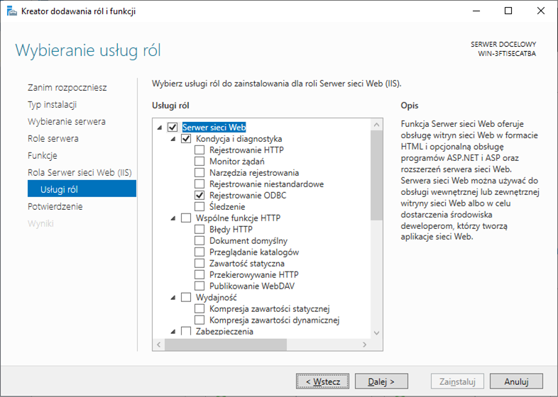
Potwierdzamy instalację
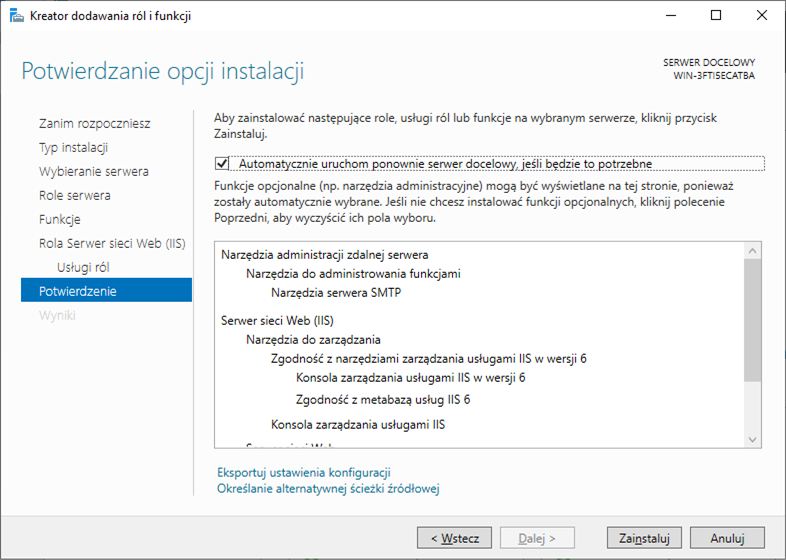

## Konfiguracja serwera 
Wchodzimy w zakładkę **Narzędzia** i wybieramy opcję **Menedzęr internetowych usług informacyjnych (IIS) 6.0**

Naciskamy prawym przyciskiem myszy na **SMTP Virtual Server #1** w wchodzimy w właściwości
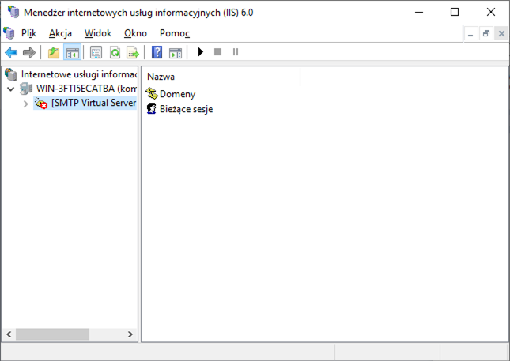
W zakładce **Dostęp** wybieramy przycisk **Przekazywanie** i naciskamy dodaj w nowo otwartym oknie
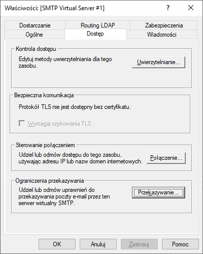
W tym oknie możemy dodać komputer podając jego IP albo grupe komputerów
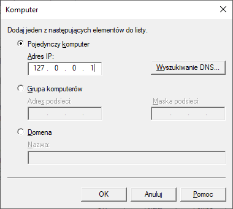
W właściwościach w oknie **Dostarczanie** możemy skonfigurować zabezpieczenia naszego serwera SMTP w tym celu naciskamy**Zabezpieczenia poczty wychodzącej**

W oknie zabezpieczenia poczty wychodzącej możemy ustawić rodzaj uwierzytelniania dostępu do naszego serwera

Po dodaniu komputerów i skonfigurowaniu zabezpieczeń według naszych potrzeb możemy uruchomic serwer klikając prawym przyciskiem na **SMTP Virtual Server #1** i wybierając opcje uruchom

