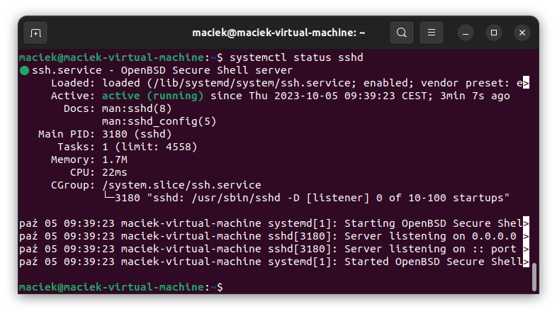
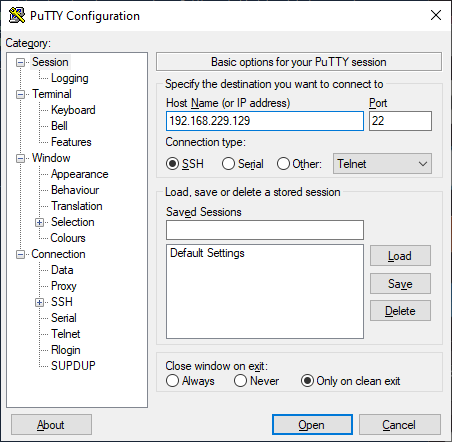
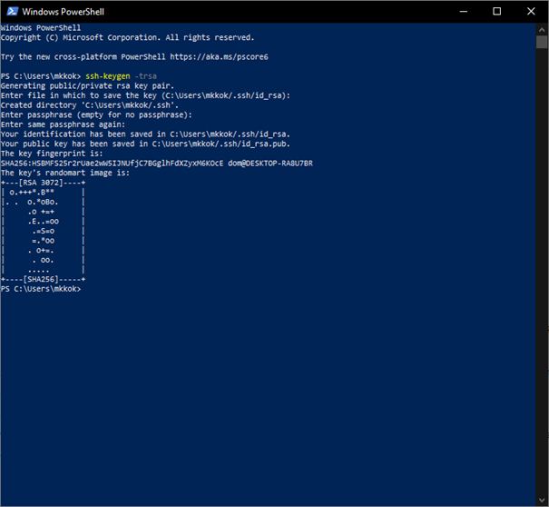
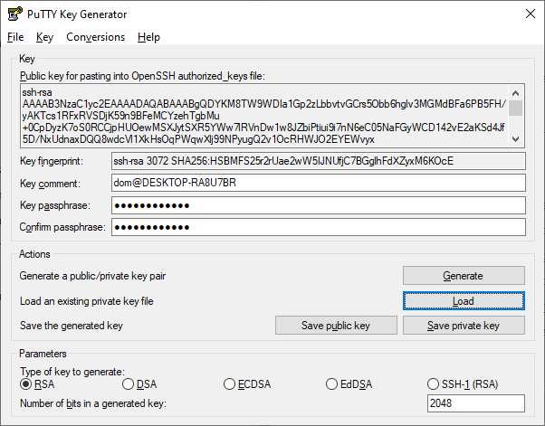
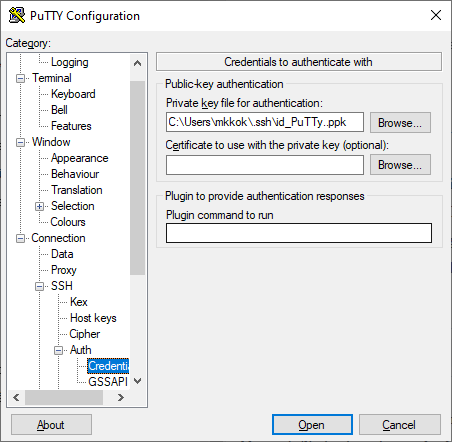
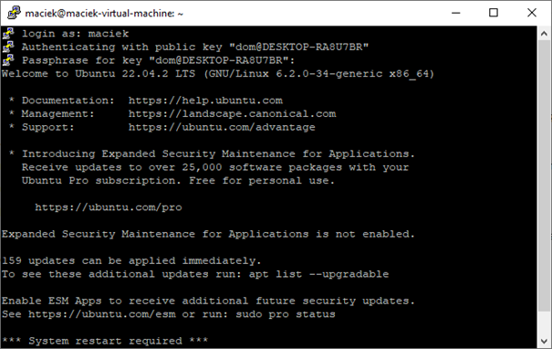

# SSH
## Czym jest SSH?
SSH (z angielskiego: Secure Shell) to protokół komunikacyjny wykorzystywany w sieciach TCP/IP, umożliwiający zdalne połączenie z serwerem. Wszystkie dane transferowane drogą SSH są szyfrowane, a uwierzytelnianie użytkowników zachodzi na wielu poziomach. Protokół SSH zastąpił Telnet, który niestety nie szyfrował danych, tym samym narażając je na wyciek. Protokół SSH działa na linii klient-serwer, domyślnie wykorzystując port 22.

## Zastosowanie SSH
SSH umożliwia wszystko to do czego wcześniej wykorzystywany był Telnet. Są to wszystkie czynności które obejmują tworzenie, przekształcanie oraz usuwanie plików i katalogów, nadawanie im uprawnień, pakowanie i rozpakowywanie archiw oraz praktycznie wszystkie sposoby zarządzania plikami dostepnymi na serwerze SSH. W związku z tym głównymi zastosowaniami SSH są:
* zdalna konfiguracja serwera
* konifguracja niepoprawnie działającego routera
* uzyskanie dostępu do zdalnych baz danych

Oprócz tego protokól SSH pozwala na bezpieczny transfer pliów oraz korzystanmie z poczty elektronicznej

## Uruchomienie i konfiguracja SSH
Najbardziej podstawowe połączenie SSH jest bardzo proste do skonfigurowania, wystarczy serwer na którym zainstalowany jest serwer ssh. W systemie Linux Ubuntu serwer SSH możemy zainstalować poleceniem:
```shell
sudo apt install ssh-server
```
Należy teraz sprawdzić czy serwer SSH działa poprawnie uzywamy do tego polecenia:
```shell
systemctl status sshd
```
Powininismy otrzymać taką informację:  
  
Teraz wystarczy połączyć się z innego komputera przy pomocy klienta SSH np. PuTTY używając IP serwera  

  
Podajemy login i hasło konta którego chcemy uzywac na **serwerze**

Takie połączeni SSH pozwala nam zdalnie połączyć się z powłoką serwera ale nie jest jest najlepszym rozwiązaniem. Protokół SSh domyślnie używa autiryzacji loginem i hasłem która nie jest zbyt bezpieczna. Pwodem tego jest duża podatnośc haseł na ataki brute-force, rozwiązeniem jest zastosowanie autoryzacji kluczami SSH która polega na wygenerowaniu dwóch kluczy jednego umieszczonego na serwerze(publicznego) i drugiego znajdującego się na komputerze z którego próbujemy się połączyć z serwerem(prywatnego). Przy każdej próbie połaczenia z serwerem klucze będą porównywane uniemozliwiając logowanie bez posiadania odpowiedniego klucza. Aby skonfigurować nasze połaczenie SSH do używania kluczy musi na początek wygenerowac nasze klucze na **kliencie z którego będziemy łączyć sie z serwerem** mozemy to zrobic przez wpisanie w PowerShell polecenia:

```shell
ssh-keygen -t rsa
```
Gdy program zapyta nas o "passphrase" możwemy podać hasło które bedzie wymagana za każdym razem gdypołączym się za pomoca naszego klucza, jeśli nic nie wpiszemy hasło nie będzie wymagane. Po wygenerowaniu klucza powinniśmy otrzymać taką informację:

  
Otrzymalismy informację o lokalizacji pliku z naszymi kluczami teraz musimy skopiować nasz klucz publiczny który domyślnie znajduje się w pliku _id\_rsa.pub_ do pliku _~/.ssh/authorized\_keys_ na **serwerze**.  
Po zapisaniu klucza publicznego na **serwerze** musi aktywować klucz prywatny na kliencie SSH. W przypadku klienta PuTTy należy najpierw zamienić format klucza SSH na taki obsługiwany przez PuTTy w tym celu musimy użyć narzędzia PuTTy Key Generator.
  
Wybieramy opcję załadowania istniejącego klucza i podajemy lokalizację naszego pliku _id\_rsa_ po czym zapisac nowy klucz prywatny obsługiwany przez PuTTy. Następnie juz w programie PuTTy w zakładkach Connection/SSH/Auth/Credentials podajemy lokalizację naszego nowego zmienionego klucza prywatnego. 

  
Po ustawieniu klucza wystarczy się zwyczajnie połączyć z serwerem SSH i wpisać passphrase,jeśli podaliśmy taki przy tworzeniu.  


