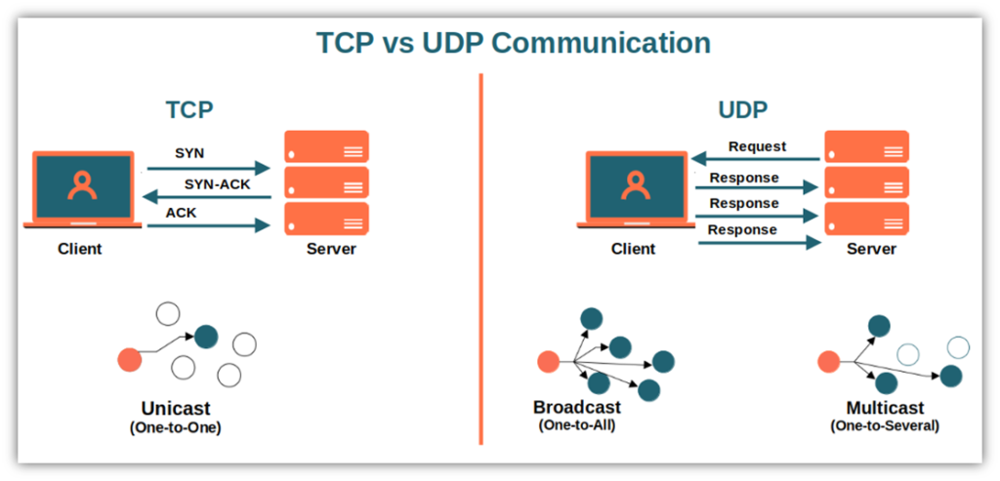
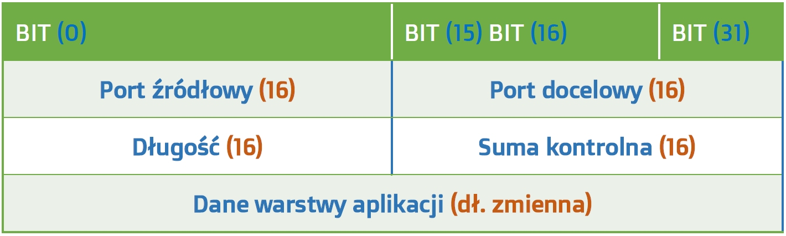

# UDP
## Czym jest UDP?
UDP(ang. User Datagram Protocol – protokół pakietów użytkownika) - protokół warstwy transportowej działający na wierzchu protokołu IP. UDP nie generuje dodatkowego ruchu na informacje zwrotne i nie czeka na potwierdzenie o otrzymaniu danych. W UDP wiadomości przujdą ale nie zawsze w poprawnej kolejności(w TCP jest ona zachowana). UDP jest jest prosty i szybki przez co jest głównie stosowany w aplikacjach czułych na czas w których szybkość jest wazniejsza niz dokładność np. strumieniowanie wideo w czasie rzeczywistym albo grach sieciowych.  

## Porównanie TCP i UDP
| TCP | UDP |
|:---:|:---:|
|Wysoka niezawodnośc działania|Niska niezawodnośc działania|
|Niska szybkośc przesyłu danych|Wysoka szybkośc przesyłu danych|
|Dane przesyłane sekwencyjnie|Dane przesyłane w Strumieniu|
|Wykrywa i korguje błędy|Nie wykrywa i nie koryguje błędów|
|Potwierdza odbiór danych|Używa jedynie sumy kontrolnej|
|Kontrola powstawania zatorów|Brak kontroli zatorów w przesyle|

## Budowa Nagłówka UDP

**Port nadawcy** - identyfikuje port z którego została wysłana wiadomość. jest polem opcjonalnym, pryjmuje wartośc zero jeśli jest nieużywany

**Port odbiorcy** - identyfikuje port odbiorcy i jest polem wymaganym

**Długość** - 16-bitowe pola specyfikują długość w bajtach całego datagramu: nagłówek i dane. Minimalna długość to 8 bajtów i jest to długość nagłówka. Wielkość pola ustala teoretyczny limit 65527 bajtów, dla danych przenoszonych przez pojedynczy datagram UDP  

**Suma kontrolna** - 16 bitowe pole, które jest użyte do sprawdzania poprawności nagłówka oraz danych. Pole jest opcjonalne. Ponieważ IP nie wylicza sumy kontrolnej dla danych, suma kontrolna UDP jest jedyną gwarancją, że dane nie zostały uszkodzone
